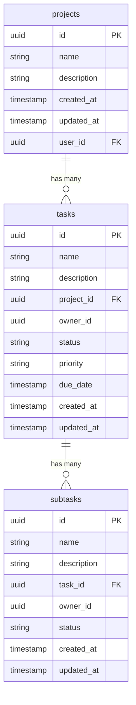

# Database Entity Relationship Diagram

## Schema Overview

The Task Manager application uses a PostgreSQL database via Supabase with the following tables and relationships:

## Relationships

- A **project** belongs to a user and can have many tasks
- A **task** belongs to a project and a user (owner), and can have many subtasks
- A **subtask** belongs to a task and a user (owner)

## Row-Level Security (RLS)

All tables implement Row-Level Security with the following policies:

### Tasks Table RLS

- **SELECT/UPDATE/DELETE**: Allowed when `auth.uid() = owner_id` OR role = `admin`
- **INSERT**: Allowed when `auth.uid() = new.owner_id`

### Subtasks Table RLS

- **SELECT/UPDATE/DELETE**: Allowed when `auth.uid() = owner_id` OR role = `admin`
- **INSERT**: Allowed when `auth.uid() = new.owner_id`

## Cascade Behavior

- When a **project** is deleted, all associated **tasks** are deleted
- When a **task** is deleted, all associated **subtasks** are deleted