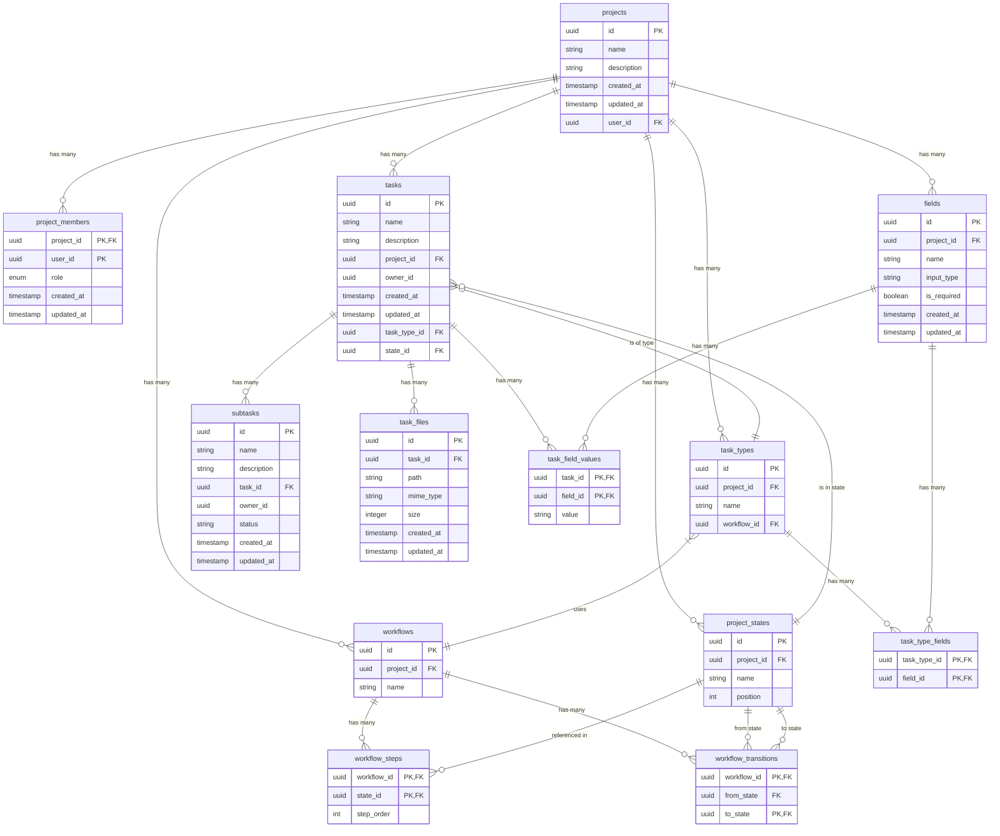

# Database Entity Relationship Diagram

## Schema Overview

The Task Manager application uses a PostgreSQL database via Supabase with the following tables and relationships:



## Relationships

- A **project** belongs to a user and can have many tasks, project states, workflows, and task types
- A **project** can have many **project members** with different roles (owner, admin, member)
- A **project state** belongs to a project and can be used in multiple workflow steps and workflow transitions
- A **workflow** belongs to a project and contains multiple workflow steps and workflow transitions
- A **workflow step** defines a state in a workflow with a specific order
- A **workflow transition** defines allowed state changes in a workflow (from one state to another)
- A **task type** belongs to a project and is linked to a specific workflow
- A **task** belongs to a project and a user (owner), can have many subtasks, can be of a task type, and can be in a state
- A **subtask** belongs to a task and a user (owner)
- A **task file** belongs to a task and is stored in the Supabase Storage bucket

## Row-Level Security (RLS)

All tables implement Row-Level Security with the following policies:

### Projects Table RLS

- **SELECT**: Allowed when user is in project_members table for the project OR role = `admin`
- **UPDATE**: Allowed when user is in project_members table with role 'owner' or 'admin' OR role = `admin`
- **DELETE**: Allowed when user is in project_members table with role 'owner' OR role = `admin`
- **INSERT**: Allowed when `auth.uid() = new.user_id`

### Project Membership RLS

- **SELECT**: Allowed when `auth.uid() = user_id` OR role = `admin`
- **INSERT**: Allowed when user is the 'owner' of the project OR role = `admin`
- **UPDATE**: Allowed when user is the 'owner' of the project OR role = `admin` (with constraint that a project must always have at least one owner)
- **DELETE**: Allowed when user is the 'owner' of the project OR role = `admin` (with constraint that a project must always have at least one owner)

### Tasks Table RLS

- **SELECT/UPDATE/DELETE**: Allowed when `auth.uid() = owner_id` OR role = `admin`
- **INSERT**: Allowed when `auth.uid() = new.owner_id`

### Subtasks Table RLS

- **SELECT/UPDATE/DELETE**: Allowed when `auth.uid() = owner_id` OR role = `admin`
- **INSERT**: Allowed when `auth.uid() = new.owner_id`

### Project States, Workflows, Workflow Steps, Workflow Transitions, Task Types RLS

- **SELECT/UPDATE/DELETE/INSERT**: Policies inherit from the Projects table, allowing access when the user is a member of the related project or is an admin.

### Fields Table RLS

- **SELECT/UPDATE/DELETE/INSERT**: Policies inherit from the Projects table, allowing access when the user is a member of the related project or is an admin.

### Task Type Fields Table RLS

- **SELECT/UPDATE/DELETE/INSERT**: Policies inherit from the Task Types table, allowing access when the user is a member of the related project or is an admin.

### Task Field Values Table RLS

- **SELECT/UPDATE/DELETE/INSERT**: Policies inherit from the Tasks table, allowing access when the user is the owner of the related task or is an admin.

### Task Files Table RLS

- **SELECT/UPDATE/DELETE**: Allowed when the user is the owner of the related task OR role = `admin`
- **INSERT**: Allowed when the user is the owner of the related task

### Storage Objects (task-files) RLS

- **SELECT/UPDATE/DELETE/INSERT**: Allowed when the user is the owner of the related task OR role = `admin`

## Cascade Behavior

- When a **project** is deleted, all associated **tasks**, **project states**, **workflows**, and **task types** are deleted (CASCADE)
- When a **workflow** is deleted, all associated **workflow steps** and **workflow transitions** are deleted (CASCADE)
- When a **task** is deleted, all associated **subtasks** and **task files** are deleted (CASCADE)
- When a **state** is deleted, the deletion will fail if it's referenced by a task
- When a **workflow** is deleted, the deletion will fail if it's referenced by a task type (RESTRICT)

## Workflow Transition Model

The task management system supports a flexible transition graph model where tasks can move between states through defined transitions:

- Each workflow has a set of **workflow transitions** that define allowed state changes
- A transition defines a path from one state (from_state) to another state (to_state) within a workflow
- A state can have multiple outgoing transitions, enabling branching workflows
- Transitions can form cycles, allowing states to loop back to previous states
- When from_state is '00000000-0000-0000-0000-000000000000' (placeholder UUID for NULL), the transition applies from any state to the specified to_state
- Example: A "Cancelled" state can be reached from any other state by defining a transition with the placeholder UUID as from_state

### Implementation Details

- For database primary key constraints, NULL values in from_state use a placeholder UUID:
  ```sql
  PRIMARY KEY (workflow_id, COALESCE(from_state, '00000000-0000-0000-0000-000000000000'), to_state)
  ```
- This allows proper indexing while maintaining the semantic meaning of "any state" transitions

### Example Transition Graph (Branching and Cyclical)

```
                                  ┌─────────────┐
                             ┌───▶│   State B   │───┐
                             │    └─────────────┘   │
                             │                      ▼
        ┌─────────────┐      │                    ┌─────────────┐
        │   State A   │──────┼───▶│   State C   │─┐│   State D   │
        └─────────────┘      │    └─────────────┘ │└─────────────┘
             ▲               │           │        │
             │               │           ▼        │
             │               │    ┌─────────────┐ │
             │               └───▶│   State H   │◀┘
             │                    └─────────────┘
             │                           ▲
             │                           │
             │                           │
             │                    ┌─────────────┐
             └────────────────────│   State G   │
                                  └─────────────┘
                                        ▲
                                       ┌┴┐
                               ┌───────┴─┴───────┐
                               │                 │
                         ┌─────────────┐   ┌─────────────┐  
                         │   State E   │   │   State F   │
                         └─────────────┘   └─────────────┘

            Any state can transition to a specific state (e.g., Cancelled)
                      using placeholder UUID for from_state
```

## Project Membership

The project membership system enables multiple users to collaborate on projects with different permission levels:

### Roles and Permissions

- **Owner**: Full control over the project, including deleting the project, managing members, and all CRUD operations
- **Admin**: Can manage project content and settings, but cannot delete the project or manage member roles
- **Member**: Can view project content and perform limited operations based on task ownership

### Key Constraints

- Each project must have exactly one owner at all times
- The owner role cannot be changed or removed unless another owner exists
- Ownership transfer requires first adding a new owner, then changing or removing the original owner

### Example Policy

```sql
-- Check if user has appropriate role for the operation
CREATE POLICY project_update_policy ON projects 
  FOR UPDATE 
  USING (
    EXISTS (
      SELECT 1 FROM project_members
      WHERE project_id = projects.id
      AND user_id = auth.uid()
      AND role IN ('owner', 'admin')
    )
    OR auth.jwt() ->> 'role' = 'admin'
  );
```