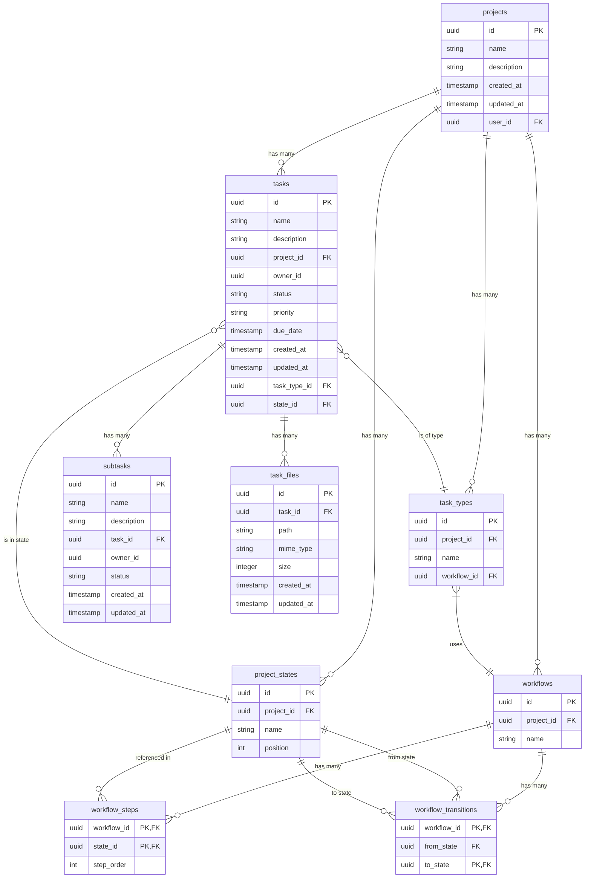

# Database Entity Relationship Diagram

## Schema Overview

The Task Manager application uses a PostgreSQL database via Supabase with the following tables and relationships:



## Relationships

- A **project** belongs to a user and can have many tasks, project states, workflows, and task types
- A **project state** belongs to a project and can be used in multiple workflow steps and workflow transitions
- A **workflow** belongs to a project and contains multiple workflow steps and workflow transitions
- A **workflow step** defines a state in a workflow with a specific order
- A **workflow transition** defines allowed state changes in a workflow (from one state to another)
- A **task type** belongs to a project and is linked to a specific workflow
- A **task** belongs to a project and a user (owner), can have many subtasks, can be of a task type, and can be in a state
- A **subtask** belongs to a task and a user (owner)
- A **task file** belongs to a task and is stored in the Supabase Storage bucket

## Row-Level Security (RLS)

All tables implement Row-Level Security with the following policies:

### Projects Table RLS

- **SELECT/UPDATE/DELETE**: Allowed when `auth.uid() = user_id` OR role = `admin`
- **INSERT**: Allowed when `auth.uid() = new.user_id`

### Tasks Table RLS

- **SELECT/UPDATE/DELETE**: Allowed when `auth.uid() = owner_id` OR role = `admin`
- **INSERT**: Allowed when `auth.uid() = new.owner_id`

### Subtasks Table RLS

- **SELECT/UPDATE/DELETE**: Allowed when `auth.uid() = owner_id` OR role = `admin`
- **INSERT**: Allowed when `auth.uid() = new.owner_id`

### Project States, Workflows, Workflow Steps, Workflow Transitions, Task Types RLS

- **SELECT/UPDATE/DELETE/INSERT**: Policies inherit from the Projects table, allowing access when the user is the owner of the related project or is an admin.

### Task Files Table RLS

- **SELECT/UPDATE/DELETE**: Allowed when the user is the owner of the related task OR role = `admin`
- **INSERT**: Allowed when the user is the owner of the related task

### Storage Objects (task-files) RLS

- **SELECT/UPDATE/DELETE/INSERT**: Allowed when the user is the owner of the related task OR role = `admin`

## Cascade Behavior

- When a **project** is deleted, all associated **tasks**, **project states**, **workflows**, and **task types** are deleted (CASCADE)
- When a **workflow** is deleted, all associated **workflow steps** and **workflow transitions** are deleted (CASCADE)
- When a **task** is deleted, all associated **subtasks** and **task files** are deleted (CASCADE)
- When a **state** is deleted, the deletion will fail if it's referenced by a task
- When a **workflow** is deleted, the deletion will fail if it's referenced by a task type (RESTRICT)

## Workflow Transition Model

The task management system supports a flexible transition graph model where tasks can move between states through defined transitions:

- Each workflow has a set of **workflow transitions** that define allowed state changes
- A transition defines a path from one state (from_state) to another state (to_state) within a workflow
- When from_state is NULL, the transition applies from any state to the specified to_state
- Example: A "Cancelled" state can be reached from any other state by defining a transition with NULL as from_state

### Example Transition Graph

```
                 ┌─────────────┐
                 │   New Task  │
                 └──────┬──────┘
                        │
                        ▼
                 ┌─────────────┐
                 │  In Progress│
                 └──────┬──────┘
                        │
                        ▼
                 ┌─────────────┐
                 │   Completed │
                 └─────────────┘
                      
                                            ┌─────────────┐
                     ────────────────────▶ │  Cancelled  │
                 Any state can transition   └─────────────┘
                    to cancelled state
```